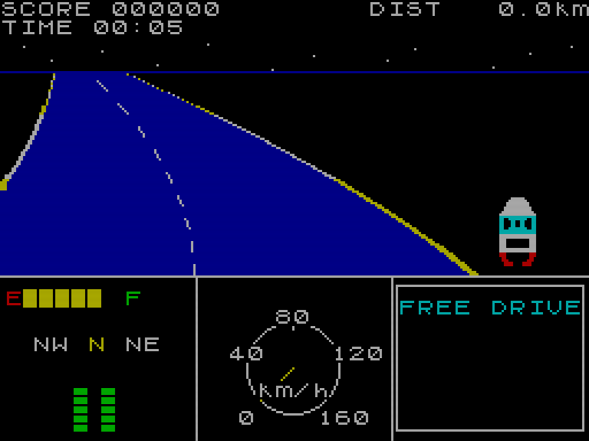

# Ice Haul

ZX Spectrum-flavoured ice-road trucking micro-sim. Not ETS2 — its 8-bit hallucination. The fantasy is **risk management**, not speed. Every metre is a decision: when to brake, when to crawl, when to risk the ice.

Built on [zx-kit](https://github.com/zrebec/zx-kit) (`zx-kit@^0.21.0`).

## Play

**[Play in browser](https://zrebec.github.io/icehaul/)** (GitHub Pages)

Or run locally:

```bash
npm install
npm run dev       # http://localhost:5173
```

## Controls

| Key | Action |
|-----|--------|
| Arrow Up | Throttle |
| Arrow Down | Brake |
| Arrow Left / Right | Steer |

**Important:** Speed never decays on asphalt or ice. The truck is heavy — once rolling, only the brake (or surface drag) slows it down. On sand and mud, speed decays passively.

On ice: **tap** the steering keys for controlled corrections. **Holding** the key causes oversteer — the drift self-amplifies and you lose control (skid).

## Screenshot



---

# Driver's Manual

## Road surfaces

The road alternates between five surface types. Each behaves differently — the same truck, the same speed, five completely different driving experiences.

### Surface overview

| Surface | Colour | Acceleration | Grip | Speed drag | Brakes | Fuel burn | Skid? |
|---------|--------|-------------|------|-----------|--------|-----------|-------|
| **Asphalt** | Dark blue | 100% (25 km/h/s) | 1.00 | None | 100% | 1.0× | No |
| **Snow** | White | 55% (13.75 km/h/s) | 0.55 | 4 km/h/s | 80% | 1.2× | Yes |
| **Ice** | Cyan stripes | **180%** (45 km/h/s) | **0.25** | None | **50%** | 0.9× | **Yes** |
| **Sand** | Yellow | **20%** (5 km/h/s) | 0.35 | **12 km/h/s** | 70% | 1.5× | No |
| **Mud** | Red+yellow dither | 35% (8.75 km/h/s) | 0.45 | 8 km/h/s | 75% | 1.3× | Yes |

### Surface details

**Asphalt** — your safe zone. Full acceleration, full grip, full brakes, no drag. Speed costs fuel, but the road is yours. Recovery asphalt segments appear after 85% of dangerous surfaces — use them to stabilise.

**Snow** — the truck slows down, wheels slip on acceleration. Steering works but with reduced grip (55%). Mild passive drag pulls speed down at 4 km/h/s. The skid mechanic is active — holding the steering key too long causes drift. Drive at moderate speed, tap the steering. Engine sounds muffled (LFSR noise, period 24).

**Ice** — the most dangerous surface. Paradoxically, the truck accelerates FASTER than on asphalt (180%) because wheels spin freely on the slick surface. But grip is only 25% — you can barely steer. Brakes are 50% effective. **On ice, the skid mechanic is brutal**: lateral velocity above 0.4 units self-amplifies at rate 3.0 × (1 − grip) = 2.25 per second. You MUST tap the steering in short bursts, never hold. The AY chip produces a sharp high-pitched whine. Curves on ice at speed are unrecoverable — **brake before the ice**.

**Sand** — the opposite of ice. The truck barely moves (20% acceleration). Wheels dig into the surface — passive drag is 12 km/h/s but it's proportional to speed, so you can always start from standstill. No skid (the problem is resistance, not slipperiness). Steering feels heavy (damping ×2.5 normal). The engine sounds deep and strained. Sand burns 1.5× fuel — going slow is cheaper per kilometre (see Fuel section). Maximum practical speed on sand is about 50 km/h.

**Mud** — between snow and sand. Moderate drag (8 km/h/s), moderate grip (0.45), moderate acceleration (35%). Steering is slightly heavy (damping ×1.5). Skid mechanic is active but more forgiving than ice. Visual: ZX colour-clash "brown" from alternating red+yellow scanlines.

### How surfaces are generated

- The game starts with **1 km of asphalt** (safe driving practice)
- After that, surfaces are randomly picked with these probabilities:
  - Asphalt 30%, Snow 22%, Ice 22%, Sand 10%, Mud 16%
- Each surface segment has a random length:
  - Asphalt: 200–800 m
  - Snow: 100–800 m
  - Ice: **100–300 m** (short — intense but brief)
  - Sand: 100–800 m
  - Mud: 100–800 m
- After every non-asphalt surface, there's an **85% chance** of a recovery asphalt segment (150–400 m). The remaining 15% is a dangerous combo (e.g. snow→ice back-to-back).

---

## Fuel system

### Consumption formula

Fuel consumption is **quadratic** — the faster you go, the more fuel you burn per kilometre:

```
fuel_per_second = speed × (speed / MAX_SPEED) × BURN_RATE × SURFACE_FUEL_MULT
```

Where `BURN_RATE = 0.00012`, `MAX_SPEED = 120 km/h`.

This means: **going slower saves fuel**, especially on expensive surfaces.

### Fuel cost per 1 km at different speeds

| Speed | Asphalt (×1.0) | Snow (×1.2) | Sand (×1.5) | Ice (×0.9) | Mud (×1.3) |
|-------|---------------|-------------|-------------|------------|------------|
| 30 km/h | 1.1% tank | 1.3% | 1.6% | 1.0% | 1.4% |
| 60 km/h | 4.3% | 5.2% | 6.5% | 3.9% | 5.6% |
| 80 km/h | 7.7% | 9.2% | **11.5%** | 6.9% | 10.0% |
| 100 km/h | 12.0% | 14.4% | **18.0%** | 10.8% | 15.6% |
| 120 km/h | 17.3% | 20.7% | **25.9%** | 15.6% | 22.5% |

**Key insight:** 800 m of sand at 30 km/h costs ~13% of your tank. At 80 km/h the same distance costs ~46%. Slow down on sand.

### Running on empty

When fuel reaches zero:
- The engine dies (no acceleration possible)
- The truck decelerates at 8 km/h/s until it stops
- Once speed drops below 1 km/h → **GAME OVER: OUT OF FUEL**

### Fuel warnings

- Below 20%: **LOW FUEL** blinks in the top status bar + warning beep every 0.8s
- Below 10%: faster blink + urgent double-beep every 0.4s

### Fuel canisters

Red+yellow canisters appear on the road every ~700 m (±40% random jitter):
- Pickup: drive directly over the canister (truck must reach or pass it)
- Each canister refills **20% of the tank** (1/5)
- Some canisters are in the centre (easy), some near the edge (risky)
- Lateral pickup radius: 0.25 normalised units

On a typical 5 km delivery run, ~7 canisters appear. Collecting them all = +140% fuel. But some are placed at the road edge or on dangerous surfaces — reaching them is a risk/reward decision.

### Delivery targets

The first delivery target is at **5 km**. Reaching it awards:
- **500 score points**
- **50% fuel refill** (half tank!)
- Celebration jingle (C-E-G chord) + green border flash

The next target is 15–25 km further. Each delivery restocks enough fuel to make the next run possible — if you drive efficiently.

---

## Steering and skid physics

### Basic steering

Steering acceleration = `STEER_ACCEL × grip` = 3.2 × surface grip.

| Surface | Effective steering | Feel |
|---------|-------------------|------|
| Asphalt | 3.20 /s² | Full, responsive |
| Snow | 1.76 /s² | Sluggish |
| Ice | **0.80 /s²** | Barely responds |
| Sand | 1.12 /s² | Works but heavy |
| Mud | 1.44 /s² | Moderate |

When you release the steering key, lateral velocity decays at rate `STEER_DAMP × grip × SURFACE_STEER_DAMP_MULT`:

| Surface | Damping rate | Effect |
|---------|-------------|--------|
| Asphalt | 5.0 /s | Snaps back to centre instantly |
| Snow | 2.75 /s | Slow return, mild drift |
| Ice | **1.25 /s** | Drift persists for seconds |
| Sand | **4.38 /s** | Heavy, resists movement (2.5× multiplier) |
| Mud | **3.38 /s** | Somewhat heavy (1.5× multiplier) |

### The skid mechanic (ice, snow, mud)

On surfaces where `SURFACE_SKID_ENABLED = true` (ice, snow, mud), a positive-feedback skid mechanic activates when lateral velocity exceeds a threshold:

```
if |lateral_velocity| > SKID_THRESHOLD (0.4):
    amplification = (|vx| - 0.4) × SKID_AMPLIFY (3.0) × (1 - grip)
    lateral_velocity += sign(vx) × amplification × dt
```

**What this means in practice:**
- **Tapping** the steering key gives small impulses. Lateral velocity stays below 0.4 → controlled, safe corrections
- **Holding** the key builds velocity past 0.4 → the drift starts accelerating itself → unrecoverable skid → off-road

The amplification strength depends on grip:

| Surface | (1 - grip) | Skid amplification | Danger |
|---------|-----------|-------------------|--------|
| Asphalt | 0 | None (disabled) | Safe to hold |
| Snow | 0.45 | Moderate (1.35/s) | Possible to recover |
| Mud | 0.55 | Medium (1.65/s) | Difficult to recover |
| Ice | **0.75** | **Severe (2.25/s)** | Nearly impossible to recover |

On ice: once past threshold, vx grows by 2.25 units per second per unit of excess. At 0.6 vx (just 0.2 above threshold): amplification = 0.2 × 2.25 = 0.45/s. Counter-steer gives only 0.80/s. You CAN fight it at low excess, but it gets worse every frame.

### Sand: resistance, not skid

Sand has skid **disabled**. Instead, the problem is **steering damping**: at 2.5× normal, the steering wheel fights you. You can turn, but the truck resists and immediately straightens. This simulates wheels digging into soft ground — the opposite of the ice problem.

---

## Curves and centrifugal force

### How curves work

The road follows a pattern: **straight → ramp → turn → ramp → straight**.

| Section | Length | Curvature |
|---------|--------|-----------|
| Straight | 200–600 m | 0 (flat) |
| Ramp in | 80 m | Smoothstep 0 → full |
| Full turn | 100–400 m | Constant (intensity 0.4–2.0) |
| Ramp out | 80 m | Smoothstep full → 0 |

Direction (left/right) and intensity are random per turn.

### Centrifugal drift

In curves, a lateral force pushes the truck toward the outside:

```
centrifugal_force = curvature × speed × CURVE_DRIFT × (1 - grip × 0.7)
```

Where `CURVE_DRIFT = 0.035`. The `(1 - grip × 0.7)` factor means low-grip surfaces amplify the drift:

| Surface | Grip factor (1 - grip×0.7) | Centrifugal at 80 km/h, curvature 1.0 |
|---------|---------------------------|---------------------------------------|
| Asphalt | 0.30 | 0.84 /s² |
| Snow | 0.615 | 1.72 /s² |
| Ice | **0.825** | **2.31 /s²** |
| Sand | 0.755 | 2.11 /s² |

On **asphalt at 80 km/h** with curvature 1.0: centrifugal = 0.84, counter-steer = 3.20 → ratio 0.26:1 → **comfortable**, hold the steering key.

On **ice at 80 km/h** with curvature 1.5: centrifugal = 3.47, counter-steer = 0.80 → ratio 4.3:1 → **impossible**. You must brake to ~35 km/h before the curve.

---

## Off-road penalties

The road edge is at ±1.1 normalised units from centre. Beyond that:

| Condition | Threshold | Effect |
|-----------|-----------|--------|
| Edge warning | \|x\| > 0.9 | Quiet tick beep every 0.5s |
| Off-road | \|x\| > 1.1 | Speed drag 55 km/h/s per unit, rumble beep, red border flash |
| Prolonged off-road | > 3 seconds | **GAME OVER: LOST CONTROL** |

Off-road also applies a lateral push-back (1.8 /s² per unit overshoot) to nudge the truck back toward the road.

---

## Sound

Engine sound uses the AY-3-8912 chip (3 channels), the same chip as in ZX Spectrum 128K:

| Channel | Role |
|---------|------|
| A | Main engine tone (pitch = speed) |
| B | Detuned harmonic (+4–10 Hz for chorus thickness) |
| C | Surface texture (changes per surface) |

Surface sound signatures:

| Surface | Channel C | Character |
|---------|----------|-----------|
| Asphalt | Silent | Clean engine only |
| Snow | LFSR noise, period 24 | Muffled crunch |
| Ice | Tone at 2.5× base freq | Sharp high-pitched whine |
| Sand | LFSR noise, period 12 | Gritty, strained |
| Mud | LFSR noise, period 18 | Dark, bubbling |

Additional sound effects (beeper):
- Tire screech: brief random-pitch beep when steering on ice/snow at speed
- Off-road rumble: low-frequency beep when outside road edge
- Canister pickup: high-pitched blip (880 Hz)
- Delivery complete: C-E-G jingle
- Low fuel: descending warning beep (double-beep when critical)

---

## Scoring

| Event | Points |
|-------|--------|
| Delivery completed | +500 |
| *(future: surface bonus, distance bonus)* | — |

---

## HUD layout

```
┌────────────────────────────────┐
│ SCORE 000000      DIST  1.2km │  status bar (2 rows)
│ TIME  01:23      ICE AHEAD    │
├────────────────────────────────┤
│                                │
│    driving viewport (13 rows)  │
│                                │
├──────────┬─────────┬──────────┤
│ E▮▮▮▮F   │    60   │ DELIVER  │  instrument panel (9 rows)
│ NW N NE  │ ◯ km/h  │  3.8km   │  3 panels: gauges | speed | mission
│ ▮▮  ▮▮   │ 0  120  │          │
└──────────┴─────────┴──────────┘
```

Left panel: FUEL gauge (E–F), compass heading (3-direction), GRIP bars (no text labels).
Centre: speedometer dial 0–120 km/h. Right: current mission + distance remaining.

---

## Tech

- **256 × 192** game pixels (ZX Spectrum native), integer-scaled ×4
- **15-colour ZX palette** only. 8×8 attribute colour clash is intentional
- **TypeScript + Vite** — no runtime dependencies besides zx-kit
- **AY-3-8912** chip emulation for 3-channel engine sound
- All tunable constants in `src/config.ts`
- CRT scanlines (alpha 0.7) + barrel distortion (intensity 0.6)
- Headless capture: `node scripts/screenshot.mjs out.png`

## Project structure

```
src/
  main.ts              entry: canvas, scene loop, CRT, audio
  config.ts            ALL tunable constants with JSDoc
  scenes/
    drive.ts           main driving scene
    gameover.ts        game over screen (fuel/offroad)
  game/
    vehicle.ts         throttle/brake/steer + per-surface physics
    road.ts            surface + curvature generator
    canisters.ts       fuel canister spawner + pickup
    roadside.ts        decorative objects (trees, lamps, signs)
  render/
    road3d.ts          pseudo-3D road + kerbs + canisters + roadside
    truck.ts           16×32 rear-view truck bitmap (AttrMap)
    hud.ts             3-panel instrument cluster
    topbar.ts          score/dist/time/warnings
  audio/
    engine.ts          AY chip engine drone (3 channels)
scripts/
  screenshot.mjs       headless Puppeteer capture
  drive-shot.mjs       automated drive + capture
```

## Roadmap

See `CLAUDE.md` for the full phased roadmap. Current status: **Phase 2 complete** — 5 surfaces, skid mechanic, fuel system, delivery targets, game over, AY sound, roadside decorations.

## License

MIT
