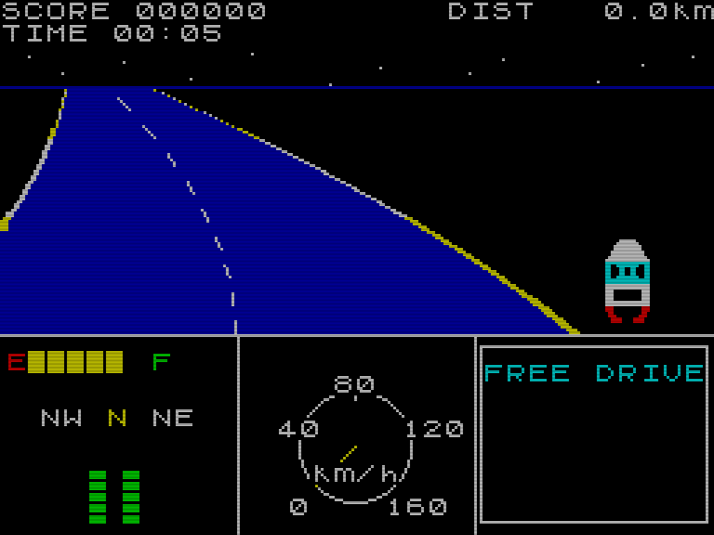

# Ice Haul

ZX Spectrum-flavoured ice-road trucking micro-sim. Not ETS2 — its 8-bit hallucination. The fantasy is **risk management**, not speed. Every metre is a decision: when to brake, when to crawl, when to risk the ice.

Built on [zx-kit](https://github.com/zrebec/zx-kit) (`zx-kit@^0.42.0`).

## Play

**[Play in browser](https://zrebec.github.io/icehaul/)** (GitHub Pages)

> **CI note (2026-07-03):** GitHub Pages deploys require `actions/upload-pages-artifact@v5+` and
> `actions/deploy-pages@v5+`. The Pages backend started rejecting v3-era artifacts on 2026-07-03 —
> the deploy fails seconds after creation with a generic *"Deployment failed, try again later"*
> while build and tests stay green. If a Pages deploy ever fails like that, check these two action
> versions FIRST.

Or run locally:

```bash
npm install
npm run dev       # http://localhost:5174
```

## Controls

| Key | Action |
|-----|--------|
| Arrow Up | Throttle |
| Arrow Down | Brake |
| Arrow Left / Right | Steer |
| **SHIFT** | **Clutch** — hold it to change gear; the skill is *when you let it out* |
| D / A | Shift up / down (only while the clutch is held) |
| Enter | Start engine · restart after a stall · start the game |
| P | Pause / unpause |
| W | Debug: cycle gross weight 10 → 20 → 30 t |

### URL switches

Work on the dev server and on the deployed build alike:

| Switch | Effect |
|--------|--------|
| `?seed=1443866` | drive a specific route. No parameter means today's daily route |
| `?glow=0` | turn the lamp bloom off. `?glow=0.5` sets its strength, `?glow=0.5,1.5` its radius too |
| `?outline=0` | traffic without its dark outline and contact shadow |
| `?matrix=1` | the traffic contact sheet instead of the game (a developer view) |

**The clutch is the whole game.** Gears do not move without **SHIFT** held — and
what matters is not how long you hold it, but the revs you let it out at. The clean
point is wherever the engine matches what the wheels will demand in the new gear,
and the tachometer shows that target as a second small needle while the pedal is
down. **Downshifting needs more revs than you have, so blip the throttle while
declutched** (yes, that is a real double-clutch); upshifting needs fewer, so wait for
them to fall. Let it out wrong and the truck lurches — badly wrong and the engine
dies. And every second you spend in neutral, you are coasting: no drive, no engine
braking, and the target moving away from you as the truck slows.

You can hear the match before you can see it — the engine note follows the revs.

**Manual 5-speed gearbox.** Each gear has its own top speed — **1st gear caps at ~28 km/h, so you can't reach 120 in a low gear** — and a power band shown on the **RPM** gauge (green → red toward redline). Acceleration is slow and heavy: climb through the gears with **D** (up) / **A** (down), watching the revs. Sit on the **redline** (red RPM) under throttle without upshifting and the engine over-revs and **burns out** — an `ENGINE REDLINE / SHIFT UP` warning gives you a few seconds before it stalls (the top gear is safe — its redline is just the speed limiter).

**Don't stall it.** Slow down or brake without downshifting and the revs fall below the gear's band — the engine **stalls** and dies (1st gear is the exception; it always idles). You get a few seconds of an **ENGINE STALLING** warning (the motor coughs) to drop a gear before it actually dies; miss it and the truck freewheels with no power until you press **Enter** to re-ignite. So as you slow for ice or traffic, **downshift** — that's the loop.

**Important:** The truck weighs 20 tonnes. It glides — engine braking is minimal, so you must **brake actively**. Braking from 120 on asphalt takes ~10 seconds; on ice ~25+.

On ice: **tap** the steering keys for controlled corrections. **Holding** the key causes oversteer — the drift self-amplifies and you lose control (skid). Same with brakes: **pump** (tap) on ice, don't hold — holding locks the wheels above 30 km/h.

## Screenshot



---

# Survival Guide

Every game is **randomly generated** — different surfaces, curves, traffic, and canister placement each run.

## Golden rules

1. **50-65 km/h is your cruising speed.** You have 8 minutes for 5 km (average ~38 km/h is enough). Don't push to max.
2. **Brake 200m BEFORE the warning.** "SNOW AHEAD" appears 120m out. At 60 km/h you need ~70m to stop. Start early.
3. **On ice: 20-30 km/h MAX.** Anything higher = skid in the first curve. No exceptions.
4. **Tap, never hold** — both steering and brakes on ice. Each tap = controlled impulse. Holding = locked wheels or oversteer.
5. **Shift to stay in the band.** Braking toward ice or traffic? Drop a gear (**A**) before the revs die. Pinned on the redline? Shift up (**D**) before it burns out. Either stall costs you an Enter restart and all your momentum.
6. **Collect every canister on asphalt.** They're free. On other surfaces, only grab centre-road ones.
7. **Recovery asphalt comes after 85% of danger zones.** Use it to stabilise speed and breathe.

## Target speeds per surface

| Surface | Safe speed | Why |
|---------|-----------|-----|
| Asphalt | 50–65 km/h | Comfortable, save fuel for hard sections |
| Snow | 30–40 km/h | Wheels slip, steering sluggish |
| Ice | **20–30 km/h** | Grip peak at vx=0.20 — one heavy steer and you're gone |
| Sand | Let it coast (~25) | You can barely accelerate anyway (0.2× accel) |
| Mud | 25–35 km/h | Manageable but heavy steering |

## Braking distances (approximate)

| From speed | Asphalt | Snow | Ice | Sand |
|-----------|---------|------|-----|------|
| 60 km/h | ~4s | ~6s | ~12s | ~7s |
| 90 km/h | ~7s | ~10s | ~20s | ~12s |
| 120 km/h | ~10s | ~14s | ~25s+ | ~16s |

On ice above 30 km/h: wheels lock → you also lose lateral control. Pump the brakes.

## Fuel management

- At 50 km/h on asphalt you burn about **17% of the tank per kilometre** — a full tank is roughly
  6 km at that speed, and 10 km if you crawl at 30.
- Canisters (+20% each) appear every ~700 m, so the road *pays* about **29% per km** if you take
  them all. Below ~87 km/h that is more than you burn, which is why a careful run never runs dry.
- Going slower saves fuel, and it saves it faster than you might think: cost per kilometre is
  **linear in speed** (the burn is quadratic, but you spend proportionally less time in the km).
- Delivery completion refills 50%.

## Traffic

- Same-direction vehicles are slower than you — overtake by shifting left or right. **They brake for
  what is ahead of them**: a sharp bend, a patch of ice or snow, and whatever is in front of them.
  Their tail lamps are dark red, and go **bright red when they brake**.
- **Brake lights are information, not decoration.** A car slowing 40 m before a hazard is telling you
  the hazard is there, often before the warning strip does.
- Oncoming vehicles travel fast on the left side, with **yellow headlights** — stay right. Red means
  going away from you, yellow means coming at you, at every distance and in every size. The
  same-direction bus is yellow-bodied and the oncoming one red, but neither body colour is what
  carries direction: the lamps and their halo do.
- Both sets of lamps **bloom** (`?glow=0` turns that off, and the colours still tell you which is
  which — the brightness change is in the pixels, not only in the glow). A braking vehicle's halo is
  wider and denser, never a different colour, so it can never read as oncoming.
- **Collision = instant game over.** Plan overtakes well ahead — acceleration takes 15+ seconds.

---

# Driver's Manual

## Road surfaces

The road alternates between five surface types. Each behaves differently — the same truck, the same speed, five completely different driving experiences.

### Surface overview

| Surface | Colour | Acceleration | Grip | Speed drag | Brakes | Fuel burn | Skid? |
|---------|--------|-------------|------|-----------|--------|-----------|-------|
| **Asphalt** | Dark blue | 100% | 1.00 | None | 18 km/h/s | 1.0× | No |
| **Snow** | White | 55% | 0.45 | 4 | 12 km/h/s | 1.2× | Yes |
| **Ice** | Cyan stripes | **180%** | **0.25** | None | **8 km/h/s** | 0.9× | **Yes** |
| **Sand** | Yellow | **35%** | 0.35 | 3 | 10 km/h/s | 1.2× | No |
| **Mud** | Red+yellow dither | 35% | 0.45 | 4 | 11 km/h/s | 1.3× | Yes |

> These are `SURFACE_*` in `src/config.ts`, which is the source of truth — the table above is a
> convenience copy and has drifted before. Snow's grip dropped from 0.55 to 0.45 in 0.11.1, which
> makes it *harder to hold than mud* at the sharpest curve (55 km/h against 60): at equal grip the
> steering damping and curve drift multipliers decide, and both favour mud. `AGENTS.md` has the
> measured envelope for every surface at every curvature.

### Surface details

**Asphalt** — your safe zone. Full acceleration, full grip, full brakes, no drag. Speed costs fuel, but the road is yours. Recovery asphalt segments appear after 85% of dangerous surfaces — use them to stabilise.

**Snow** — the truck slows down, wheels slip on acceleration. Steering works but with reduced grip (55%). Mild passive drag pulls speed down at 4 km/h/s. The skid mechanic is active — holding the steering key too long causes drift. Drive at moderate speed, tap the steering. Engine sounds muffled (LFSR noise, period 24).

**Ice** — the most dangerous surface. Paradoxically, the truck accelerates FASTER than on asphalt (180%) because wheels spin freely on the slick surface. But grip is only 25% — you can barely steer. Brakes are 50% effective. **On ice, the skid mechanic is brutal**: lateral velocity above 0.4 units self-amplifies at rate 3.0 × (1 − grip) = 2.25 per second. You MUST tap the steering in short bursts, never hold. The AY chip produces a sharp high-pitched whine. Curves on ice at speed are unrecoverable — **brake before the ice**.

**Sand** — the opposite of ice. The truck barely moves (20% acceleration). Wheels dig into the surface — passive drag is 12 km/h/s but it's proportional to speed, so you can always start from standstill. No skid (the problem is resistance, not slipperiness). Steering feels heavy (damping ×2.5 normal). The engine sounds deep and strained. Sand burns 1.5× fuel — going slow is cheaper per kilometre (see Fuel section). Maximum practical speed on sand is about 50 km/h.

**Mud** — between snow and sand. Moderate drag (8 km/h/s), moderate grip (0.45), moderate acceleration (35%). Steering is slightly heavy (damping ×1.5). Skid mechanic is active but more forgiving than ice. Visual: ZX colour-clash "brown" from alternating red+yellow scanlines.

### How surfaces are generated

- The game starts with **1 km of asphalt** (safe driving practice)
- After that, surfaces are randomly picked with these probabilities:
  - Asphalt 30%, Snow 22%, Ice 22%, Sand 10%, Mud 16%
- Each surface segment has a random length:
  - Asphalt: 200–800 m
  - Snow: 100–800 m
  - Ice: **100–300 m** (short — intense but brief)
  - Sand: 100–800 m
  - Mud: 100–800 m
- After every non-asphalt surface, there's an **85% chance** of a recovery asphalt segment (150–400 m). The remaining 15% is a dangerous combo (e.g. snow→ice back-to-back).

---

## Fuel system

### Consumption formula

Fuel consumption is **quadratic** — the faster you go, the more fuel you burn per kilometre:

```
fuel_per_second = speed × (speed / MAX_SPEED) × BURN_RATE × SURFACE_FUEL_MULT
```

Where `BURN_RATE = 0.000110`, `MAX_SPEED = 120 km/h`, fractions of a full tank.

Per **kilometre** it collapses to something much simpler, because the faster you go the less time
you spend in that kilometre:

```
fuel_per_km = speed × 0.0033 × SURFACE_FUEL_MULT
```

So cost per kilometre is **linear in speed**: 30 km/h costs 9.9% of the tank, 60 km/h costs 19.8%,
120 km/h costs 39.6%. Going slower saves fuel, especially on expensive surfaces.

### Fuel cost per 1 km at different speeds

| Speed | Asphalt (×1.0) | Snow (×1.2) | Sand (×1.2) | Ice (×0.9) | Mud (×1.3) |
|-------|---------------|-------------|-------------|------------|------------|
| 30 km/h | 9.9% tank | 11.9% | 11.9% | 8.9% | 12.9% |
| 60 km/h | 19.8% | 23.8% | 23.8% | 17.8% | 25.7% |
| 80 km/h | 26.4% | 31.7% | 31.7% | 23.8% | 34.3% |
| 100 km/h | 33.0% | 39.6% | 39.6% | 29.7% | 42.9% |
| 120 km/h | 39.6% | 47.5% | 47.5% | 35.6% | 51.5% |

**Key insight:** the road hands out **28.6% of a tank per kilometre** in canisters (one every 700 m,
20% each). Set that equal to the burn and you get the speed at which fuel starts to be a real
constraint:

| Surface | Break-even speed |
|---------|------------------|
| Ice (×0.9) | 96 km/h |
| Asphalt (×1.0) | **87 km/h** |
| Snow / sand (×1.2) | 72 km/h |
| Mud (×1.3) | 67 km/h |

Below those speeds the road pays for itself, if you collect what it puts in front of you. Above
them the tank is a clock. On most routes the controllability envelope forbids those speeds anyway,
which is why fuel rarely decides a careful run — see `AGENTS.md`, "Playtest findings, 0.11.1".

### Running on empty

When fuel reaches zero:
- The engine dies (no acceleration possible)
- The truck decelerates at 8 km/h/s until it stops
- Once speed drops below 1 km/h → **GAME OVER: OUT OF FUEL**

### Fuel warnings

- Below 20%: **LOW FUEL** blinks in the top status bar + warning beep every 0.8s
- Below 10%: faster blink + urgent double-beep every 0.4s

### Fuel canisters

Red+yellow canisters appear on the road every ~700 m (±40% random jitter):
- Pickup: drive directly over the canister (truck must reach or pass it)
- Each canister refills **20% of the tank** (1/5)
- Some canisters are in the centre (easy), some near the edge (risky)
- Lateral pickup radius: 0.25 normalised units

On a typical 5 km delivery run, ~7 canisters appear. Collecting them all = +140% fuel. But some are placed at the road edge or on dangerous surfaces — reaching them is a risk/reward decision.

### Delivery targets

The first delivery target is at **5 km**. Reaching it awards:
- **500 score points**
- **50% fuel refill** (half tank!)
- Celebration jingle (C-E-G chord) + green border flash

The next target is **5–8 km** further, drawn from the route seed. Every leg gets the same *average
speed* to beat rather than the same number of minutes — the budget is `length / 37.5 km/h`, so the
first leg is still exactly 8 minutes for 5 km — and **unused time carries over in full**. A leg used
to reset the clock to a flat 8 minutes regardless of length, which made anything past the first
delivery arithmetically impossible; that was fixed in 0.9.0.

Both halves of that are being re-examined: a competent run holds 42–46 km/h against a 37.5 km/h
pace, so the surplus compounds and the clock stops biting after the first delivery. Numbers in
`AGENTS.md`.

---

## Steering and skid physics

### Basic steering

Steering acceleration = `STEER_ACCEL × grip` = 3.2 × surface grip.

| Surface | Effective steering | Feel |
|---------|-------------------|------|
| Asphalt | 3.20 /s² | Full, responsive |
| Snow | 1.76 /s² | Sluggish |
| Ice | **0.80 /s²** | Barely responds |
| Sand | 1.12 /s² | Works but heavy |
| Mud | 1.44 /s² | Moderate |

When you release the steering key, lateral velocity decays at rate `STEER_DAMP × grip × SURFACE_STEER_DAMP_MULT`:

| Surface | Damping rate | Effect |
|---------|-------------|--------|
| Asphalt | 5.0 /s | Snaps back to centre instantly |
| Snow | 2.75 /s | Slow return, mild drift |
| Ice | **1.25 /s** | Drift persists for seconds |
| Sand | **4.38 /s** | Heavy, resists movement (2.5× multiplier) |
| Mud | **3.38 /s** | Somewhat heavy (1.5× multiplier) |

### The skid mechanic (ice, snow, mud)

On surfaces where `SURFACE_SKID_ENABLED = true` (ice, snow, mud), a positive-feedback skid mechanic activates when lateral velocity exceeds a threshold:

```
if |lateral_velocity| > SKID_THRESHOLD (0.4):
    amplification = (|vx| - 0.4) × SKID_AMPLIFY (3.0) × (1 - grip)
    lateral_velocity += sign(vx) × amplification × dt
```

**What this means in practice:**
- **Tapping** the steering key gives small impulses. Lateral velocity stays below 0.4 → controlled, safe corrections
- **Holding** the key builds velocity past 0.4 → the drift starts accelerating itself → unrecoverable skid → off-road

The amplification strength depends on grip:

| Surface | (1 - grip) | Skid amplification | Danger |
|---------|-----------|-------------------|--------|
| Asphalt | 0 | None (disabled) | Safe to hold |
| Snow | 0.45 | Moderate (1.35/s) | Possible to recover |
| Mud | 0.55 | Medium (1.65/s) | Difficult to recover |
| Ice | **0.75** | **Severe (2.25/s)** | Nearly impossible to recover |

On ice: once past threshold, vx grows by 2.25 units per second per unit of excess. At 0.6 vx (just 0.2 above threshold): amplification = 0.2 × 2.25 = 0.45/s. Counter-steer gives only 0.80/s. You CAN fight it at low excess, but it gets worse every frame.

### Sand: resistance, not skid

Sand has skid **disabled**. Instead, the problem is **steering damping**: at 2.5× normal, the steering wheel fights you. You can turn, but the truck resists and immediately straightens. This simulates wheels digging into soft ground — the opposite of the ice problem.

---

## Curves and centrifugal force

### How curves work

The road follows a pattern: **straight → ramp → turn → ramp → straight**.

| Section | Length | Curvature |
|---------|--------|-----------|
| Straight | 200–600 m | 0 (flat) |
| Ramp in | 80 m | Smoothstep 0 → full |
| Full turn | 100–400 m | Constant (intensity 0.4–2.0) |
| Ramp out | 80 m | Smoothstep full → 0 |

Direction (left/right) and intensity are random per turn.

### Centrifugal drift

In curves, a lateral force pushes the truck toward the outside:

```
centrifugal_force = curvature × speed × CURVE_DRIFT × (1 - grip × 0.7)
```

Where `CURVE_DRIFT = 0.035`. The `(1 - grip × 0.7)` factor means low-grip surfaces amplify the drift:

| Surface | Grip factor (1 - grip×0.7) | Centrifugal at 80 km/h, curvature 1.0 |
|---------|---------------------------|---------------------------------------|
| Asphalt | 0.30 | 0.84 /s² |
| Snow | 0.615 | 1.72 /s² |
| Ice | **0.825** | **2.31 /s²** |
| Sand | 0.755 | 2.11 /s² |

On **asphalt at 80 km/h** with curvature 1.0: centrifugal = 0.84, counter-steer = 3.20 → ratio 0.26:1 → **comfortable**, hold the steering key.

On **ice at 80 km/h** with curvature 1.5: centrifugal = 3.47, counter-steer = 0.80 → ratio 4.3:1 → **impossible**. You must brake to ~35 km/h before the curve.

---

## Off-road penalties

The road edge is at ±1.1 normalised units from centre. Beyond that:

| Condition | Threshold | Effect |
|-----------|-----------|--------|
| Edge warning | \|x\| > 0.9 | Quiet tick beep every 0.5s |
| Off-road | \|x\| > 1.1 | Speed drag 55 km/h/s per unit, rumble beep, red border flash |
| Prolonged off-road | > 3 seconds | **GAME OVER: LOST CONTROL** |

Off-road also applies a lateral push-back (1.8 /s² per unit overshoot) to nudge the truck back toward the road.

---

## Sound

Engine sound uses the AY-3-8912 chip (3 channels), the same chip as in ZX Spectrum 128K:

| Channel | Role |
|---------|------|
| A | Main engine tone (pitch = speed) |
| B | Detuned harmonic (+4–10 Hz for chorus thickness) |
| C | Surface texture (changes per surface) |

Surface sound signatures:

| Surface | Channel C | Character |
|---------|----------|-----------|
| Asphalt | Silent | Clean engine only |
| Snow | LFSR noise, period 24 | Muffled crunch |
| Ice | Tone at 2.5× base freq | Sharp high-pitched whine |
| Sand | LFSR noise, period 12 | Gritty, strained |
| Mud | LFSR noise, period 18 | Dark, bubbling |

Additional sound effects (beeper):
- Tire screech: brief random-pitch beep when steering on ice/snow at speed
- Off-road rumble: low-frequency beep when outside road edge
- Canister pickup: high-pitched blip (880 Hz)
- Delivery complete: C-E-G jingle
- Low fuel: descending warning beep (double-beep when critical)

---

## Scoring

| Event | Points |
|-------|--------|
| Every 100 m of road covered | +10, multiplied by the surface |
| Delivery completed | +500 |

Surface multipliers: asphalt ×1.0, mud ×1.1, snow ×1.2, sand ×1.3, **ice ×1.4**. The road pays for
itself now rather than only paying on arrival — 5 km of ice, every bend held, used to be worth the
same nothing as 5 km of asphalt. Points land in whole 100 m blocks, never in `dt`-scaled fractions,
so a slow machine and a fast one finish the same route with the same score.

### Results screen

A run ends on a summary rather than a headline: distance, total driving time (across every
delivery, never reset), **average speed**, **canisters collected** and score. Average speed is the
one number that turns a run into feedback — 5 km in 8 minutes is 38 km/h, and a run that reads 24
lost the delivery to the ice long before the clock said so.

---

## HUD layout

```
┌────────────────────────────────┐
│ SCORE 000000      DIST  1.2km │  status bar (2 rows)
│ TIME  01:23      ICE 120m >>  │
├────────────────────────────────┤
│                                │
│    driving viewport (11 rows)  │
│                                │
├──────────┬─────────┬──────────┤
│ E▮▮▮▮F   │   ◯     │ DELIVER  │  instrument panel (9 rows)
│ RPM ▮▮▮  │ RPM 0850│  3.8km   │  3 panels: drivetrain | tacho | mission
│ GEAR 3/5 │ SPD  47 │  07:52   │
│ GRIP ▮▮▮ │         │   20t    │
└──────────┴─────────┴──────────┘
```

Left panel: FUEL bar, **RPM bar**, **GEAR** (current/total, flashing red on a refused downshift),
GRIP bar. Centre: a **tachometer** — the needle is real engine revs and reddens at the redline —
with numeric RPM and speed under it. The compass and the speedometer dial are gone; the centre
panel became a tacho when the gearbox arrived, because what you need to read mid-corner is whether
you are about to lug the engine. Right: mission, distance remaining, time left, gross weight.

---

## Tech

- **256 × 192** game pixels (ZX Spectrum native), integer-scaled ×4
- **15-colour ZX palette** in the framebuffer. 8×8 attribute colour clash is intentional
- **TypeScript + Vite** — no runtime dependencies besides zx-kit
- **AY-3-8912** chip emulation for 3-channel engine sound
- All tunable constants in `src/config.ts`
- CRT scanlines (alpha 0.7) + barrel distortion (intensity 0.6)
- **Lamp bloom** composited over the finished frame — the one place off-palette colour appears, and
  it happens on the glass, in front of the scanlines, never in the framebuffer. `?glow=0` restores
  a byte-identical picture
- Headless capture: `node scripts/screenshot.mjs out.png`, contact sheets via
  `node scripts/traffic-matrix.mjs`

## Project structure

```
src/
  main.ts              entry: canvas, scene loop, CRT, audio, URL switches
  config.ts            ALL tunable constants with JSDoc
  scenes/
    drive.ts           main driving scene
    gameover.ts        results screen
  game/
    vehicle.ts         throttle/brake/steer/clutch + per-surface physics
    road.ts            surface + curvature generator
    roadgeometry.ts    where the road edge is, for off-road and for tests
    offroad.ts         off-road detection + pixel-perfect traffic collision
    traffic.ts         traffic spawner, car-following, brake state
    canisters.ts       fuel canister spawner + pickup
    roadside.ts        decorative objects (trees, lamps, signs)
    mission.ts         delivery targets, the clock and its carry-over
    score.ts           continuous scoring, paid by the block
    runStats.ts        what a finished run was worth
    seed.ts            one route per day, overridable with ?seed=
  render/
    road3d.ts          pseudo-3D road + kerbs + canisters + roadside + traffic
    projection.ts      the shared curve-offset maths
    vehicleRaster.ts   one raster per drawn vehicle: draw, collide, glow
    vehicleLod.ts      far/detail tiers — meaning in the distance
    vehicleContour.ts  the dark outline and contact shadow
    vehicleGlow.ts     lamp bloom through zx-kit's glow layer
    truck.ts           32×40 rear-view truck bitmap (AttrMap)
    hud.ts             3-panel instrument cluster
    topbar.ts          score/dist/time/warnings
    sprites/           the hand-drawn vehicles and roadside objects
    debug/             the traffic contact sheet (?matrix=1)
  audio/
    engine.ts          AY chip engine drone (3 channels)
scripts/
  screenshot.mjs       headless Puppeteer capture
  drive-shot.mjs       automated drive + capture
  traffic-matrix.mjs   contact sheets — the renderer comparison harness
```

## Roadmap

See `CLAUDE.md` for the full phased roadmap and `AGENTS.md` for what is actually being worked on
next. Current status: **phases 1–5 essentially complete** — five surfaces with a measured
controllability envelope, the skid mechanic, a manual clutched gearbox with stall and burn-out,
fuel, traffic with pixel-perfect collision, proportional delivery targets, continuous scoring, a
results screen, AY sound and roadside decoration. The graphics thread has been through one shared
raster, an LOD tier, a hyperbolic growth curve, a hand redraw of all six vehicles and the lamp
bloom. Next up: traffic density that scales with distance, then distance fog and night.

## License

MIT
